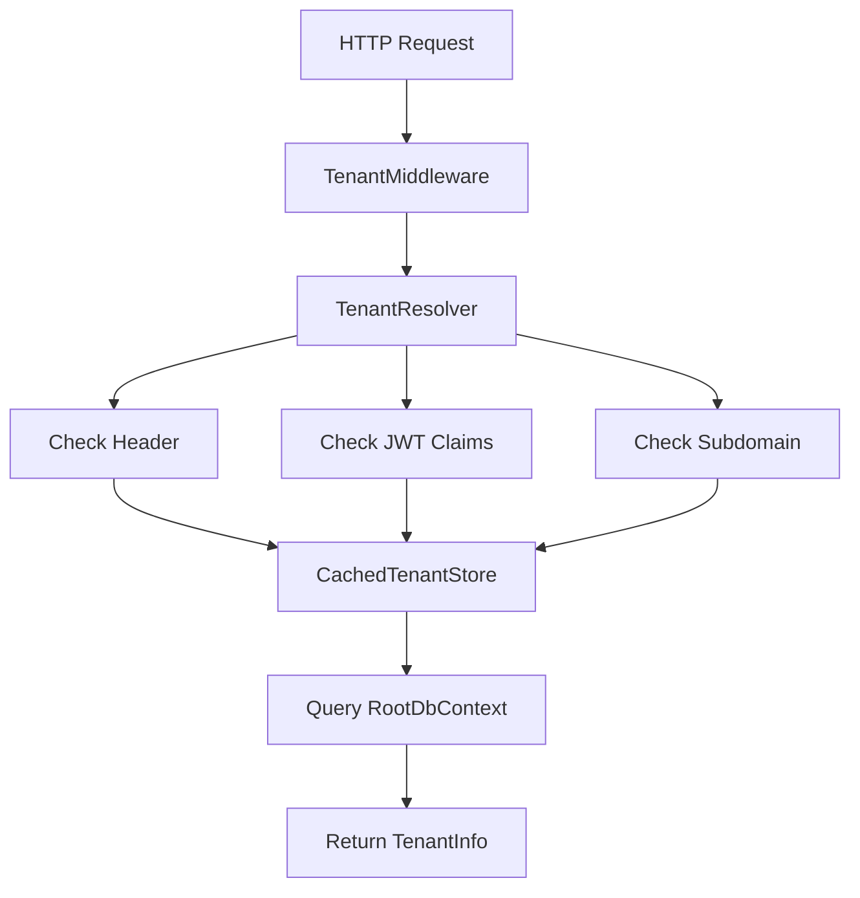
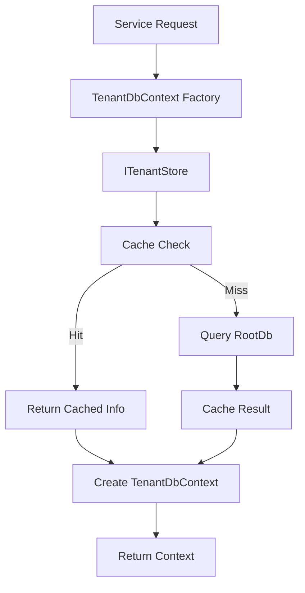

I'll explain the flow of how both database contexts are initialized with their connection strings in this multi-tenant architecture.

### 1. Root Database Context Initialization

The root database connection is configured in `Program.cs`:


```94:96:src/starterkit.API/Program.cs
// Configure Root Database
builder.Services.AddDbContext<RootDbContext>(options =>
    options.UseSqlServer(builder.Configuration.GetConnectionString("RootConnection")));
```


This adds the RootDbContext with a single, fixed connection string from configuration. The root database connection string is stored in configuration (appsettings.json) under "ConnectionStrings:RootConnection".

### 2. Tenant Database Context Factory Registration

The tenant database context is more complex because each tenant has its own database. The registration happens in `ServiceCollectionExtensions.cs`:


```30:40:src/starterkit.Infrastructure/Extensions/ServiceCollectionExtensions.cs
            services.AddScoped<Func<string, TenantDbContext>>(sp => tenantId =>
            {
                var tenantStore = sp.GetRequiredService<ITenantStore>();
                var tenant = tenantStore.GetTenantAsync(tenantId).Result;
                if (tenant == null)
                    throw new InvalidOperationException($"Tenant {tenantId} not found");

                var optionsBuilder = new DbContextOptionsBuilder<TenantDbContext>();
                optionsBuilder.UseSqlServer(tenant.ConnectionString);
                return new TenantDbContext(optionsBuilder.Options, tenantId);
            });
```


Let's break down the flow:

1. **Tenant Resolution**:
   - When a request comes in, the `TenantMiddleware` processes it:
   
```35:42:src/starterkit.API/Middlewares/TenantMiddleware.cs
            var tenant = await tenantResolver.ResolveTenantAsync(context);
            
            if (tenant == null)
            {
                context.Response.StatusCode = StatusCodes.Status400BadRequest;
                await context.Response.WriteAsJsonAsync(new { error = "Invalid or missing tenant identifier. Please ensure tenant ID is provided in the X-Tenant-ID header or JWT token." });
                return;
            }
```


2. **Tenant Store**:
   - The `CachedTenantStore` retrieves tenant information including connection string:
   
```30:47:src/starterkit.Infrastructure/MultiTenancy/Stores/CachedTenantStore.cs
                var tenant = await _context.Tenants
                    .FirstOrDefaultAsync(t => 
                        t.Id.ToString().ToLower() == identifier.ToLower() ||
                        t.Name.ToLower() == identifier.ToLower() || 
                        t.DatabaseName.ToLower() == identifier.ToLower());

                if (tenant == null)
                    return null;

                return new TenantInfo
                {
                    Id = tenant.Id,
                    Name = tenant.Name,
                    DatabaseName = tenant.DatabaseName,
                    ConnectionString = tenant.ConnectionString,
                    Status = tenant.Status
                };
            });
```


3. **Database Context Creation**:
   - When a tenant-specific operation is needed, the factory creates a new `TenantDbContext` with the tenant's connection string
   - The connection string is stored in the `Tenants` table in the root database
   - Initial tenant connection strings are seeded in `RootDbSeeder`:
   
```53:71:src/starterkit.Infrastructure/Data/RootDb/RootDbSeeder.cs
                var tenants = new[]
                {
                    new Tenant
                    {
                        Name = "Alpha",
                        DatabaseName = "alpha_tenant",
                        ConnectionString = "Server=localhost;Database=alpha_tenant;User Id=sa;Password=YourStrong@Passw0rd;TrustServerCertificate=True;MultipleActiveResultSets=true;",
                        Status = TenantStatus.Active,
                        CreatedBy = Guid.Empty // System
                    },
                    new Tenant
                    {
                        Name = "Beta",
                        DatabaseName = "beta_tenant",
                        ConnectionString = "Server=localhost;Database=beta_tenant;User Id=sa;Password=YourStrong@Passw0rd;TrustServerCertificate=True;MultipleActiveResultSets=true;",
                        Status = TenantStatus.Active,
                        CreatedBy = Guid.Empty // System
                    }
                };
```


### Key Points:

1. **Root Database**:
   - Single connection string
   - Configured at startup
   - Stores tenant configurations
   - Used for global operations

2. **Tenant Databases**:
   - Dynamic connection strings per tenant
   - Created on-demand using factory pattern
   - Connection strings stored in root database
   - Scoped to tenant-specific operations

3. **Connection String Flow**:
```
Request → TenantMiddleware → TenantResolver → CachedTenantStore → 
Root Database (get connection string) → TenantDbContext Factory → 
Tenant-specific Database Connection
```

4. **Caching**:
   - Tenant information (including connection strings) is cached for 10 minutes:
   
```12:12:src/starterkit.Infrastructure/MultiTenancy/Stores/CachedTenantStore.cs
        private readonly TimeSpan _cacheDuration = TimeSpan.FromMinutes(10);
```


This architecture ensures:
- Clear separation between global and tenant-specific data
- Efficient connection management
- Proper tenant isolation
- Performance optimization through caching
- Scalability for multiple tenants

The system maintains a single root database connection while dynamically managing multiple tenant database connections based on the incoming request's tenant context.


I'll explain the detailed call stack flow for database initialization and querying in this multi-tenant architecture.

### 1. Initial Setup and Registration

The setup begins in `Program.cs` where both database contexts are registered:


```94:108:src/starterkit.API/Program.cs
// Configure Root Database
builder.Services.AddDbContext<RootDbContext>(options =>
    options.UseSqlServer(builder.Configuration.GetConnectionString("RootConnection")));

// Configure Tenant Database (Scoped factory)
builder.Services.AddScoped<Func<string, TenantDbContext>>(serviceProvider => databaseName =>
{
    var tenant = serviceProvider.GetService<ITenantStore>()?.GetTenantAsync(databaseName).Result;
    if (tenant == null)
        throw new Exception($"Tenant with database name '{databaseName}' is not found");

    var optionsBuilder = new DbContextOptionsBuilder<TenantDbContext>();
    optionsBuilder.UseSqlServer(tenant.ConnectionString);
    return new TenantDbContext(optionsBuilder.Options, databaseName);
});
```


The root database gets a direct connection string from configuration, while the tenant database is registered as a factory that creates database contexts on demand.

### 2. Service Collection Extensions

The detailed registration happens in `ServiceCollectionExtensions.cs`:


```22:47:src/starterkit.Infrastructure/Extensions/ServiceCollectionExtensions.cs
            services.AddDbContext<RootDbContext>(options =>
                options.UseSqlServer(configuration.GetConnectionString("RootConnection")));
            services.AddScoped<IRootDbContext>(sp => sp.GetRequiredService<RootDbContext>());

            // Add tenant store (needs to be before tenant context registration)
            services.AddScoped<ITenantStore, CachedTenantStore>();

            // Register tenant DbContext factory
            services.AddScoped<Func<string, TenantDbContext>>(sp => tenantId =>
            {
                var tenantStore = sp.GetRequiredService<ITenantStore>();
                var tenant = tenantStore.GetTenantAsync(tenantId).Result;
                if (tenant == null)
                    throw new InvalidOperationException($"Tenant {tenantId} not found");

                var optionsBuilder = new DbContextOptionsBuilder<TenantDbContext>();
                optionsBuilder.UseSqlServer(tenant.ConnectionString);
                return new TenantDbContext(optionsBuilder.Options, tenantId);
            });

            // Register tenant context interface factory
            services.AddScoped<Func<string, ITenantDbContext>>(sp => tenantId =>
            {
                var factory = sp.GetRequiredService<Func<string, TenantDbContext>>();
                return factory(tenantId);
            });
```


Here's the flow:

1. **Root Database Registration**:
   ```mermaid
   graph TD
      A[Program.cs] --> B[AddTenantServices]
      B --> C[Register RootDbContext]
      C --> D[Configure with Root Connection String]
      D --> E[Register IRootDbContext Interface]
   ```

2. **Tenant Database Registration**:
   ```mermaid
   graph TD
      A[Program.cs] --> B[AddTenantServices]
      B --> C[Register ITenantStore]
      C --> D[Register TenantDbContext Factory]
      D --> E[Register ITenantDbContext Factory]
   ```

### 3. Tenant Resolution Flow

When a request comes in, the `TenantMiddleware` handles tenant resolution:


```35:56:src/starterkit.API/Middlewares/TenantMiddleware.cs
            var tenant = await tenantResolver.ResolveTenantAsync(context);
            
            if (tenant == null)
            {
                context.Response.StatusCode = StatusCodes.Status400BadRequest;
                await context.Response.WriteAsJsonAsync(new { error = "Invalid or missing tenant identifier. Please ensure tenant ID is provided in the X-Tenant-ID header or JWT token." });
                return;
            }

            if (tenant.Status != Core.Enums.TenantStatus.Active)
            {
                context.Response.StatusCode = StatusCodes.Status403Forbidden;
                await context.Response.WriteAsJsonAsync(new { error = "Tenant is not active" });
                return;
            }

            // Initialize tenant database if needed
            await databaseInitializer.InitializeTenantDatabaseAsync(tenant.DatabaseName);

            // Store tenant info in HttpContext items
            context.Items["Tenant"] = tenant.DatabaseName;

```


The resolution process:



### 4. Database Context Usage

#### Root Database Access:
```csharp
// Direct injection
public class SomeService
{
    private readonly IRootDbContext _rootContext;
    
    public SomeService(IRootDbContext rootContext)
    {
        _rootContext = rootContext;
    }
}
```

#### Tenant Database Access:
```csharp
// Using factory
public class SomeService
{
    private readonly Func<string, ITenantDbContext> _tenantContextFactory;
    
    public SomeService(Func<string, ITenantDbContext> tenantContextFactory)
    {
        _tenantContextFactory = tenantContextFactory;
    }
    
    public async Task DoSomething(string tenantId)
    {
        using var tenantDb = _tenantContextFactory(tenantId);
        // Use tenantDb
    }
}
```

### 5. Tenant Database Resolution Flow

When accessing a tenant database:

1. **Request for Tenant Context**:

```30:40:src/starterkit.Infrastructure/Extensions/ServiceCollectionExtensions.cs
            services.AddScoped<Func<string, TenantDbContext>>(sp => tenantId =>
            {
                var tenantStore = sp.GetRequiredService<ITenantStore>();
                var tenant = tenantStore.GetTenantAsync(tenantId).Result;
                if (tenant == null)
                    throw new InvalidOperationException($"Tenant {tenantId} not found");

                var optionsBuilder = new DbContextOptionsBuilder<TenantDbContext>();
                optionsBuilder.UseSqlServer(tenant.ConnectionString);
                return new TenantDbContext(optionsBuilder.Options, tenantId);
            });
```


2. **Tenant Store Lookup**:

```8:12:src/starterkit.Infrastructure/MultiTenancy/Stores/CachedTenantStore.cs
    public class CachedTenantStore : ITenantStore
    {
        private readonly IRootDbContext _context;
        private readonly IMemoryCache _cache;
        private readonly TimeSpan _cacheDuration = TimeSpan.FromMinutes(10);
```


The complete flow:



### 6. Connection String Management

The tenant connection strings are stored in the root database:


```6:13:src/starterkit.Core/Entities/Global/Tenant.cs
    public class Tenant : BaseEntity
    {
        public string Name { get; set; }
        public string DatabaseName { get; set; }
        public string ConnectionString { get; set; }
        public TenantStatus Status { get; set; }
    }
} 
```


And configured in the database:


```9:35:src/starterkit.Infrastructure/Data/RootDb/Configurations/TenantConfiguration.cs
        public void Configure(EntityTypeBuilder<Tenant> builder)
        {
            builder.ToTable("Tenants");

            builder.HasKey(t => t.Id);

            builder.Property(t => t.Name)
                .IsRequired()
                .HasMaxLength(100);

            builder.Property(t => t.DatabaseName)
                .IsRequired()
                .HasMaxLength(100);

            builder.Property(t => t.ConnectionString)
                .IsRequired()
                .HasMaxLength(500);

            builder.Property(t => t.Status)
                .IsRequired();

            builder.HasIndex(t => t.Name)
                .IsUnique();

            builder.HasIndex(t => t.DatabaseName)
                .IsUnique();
        }
```


This architecture ensures:
- Secure storage of connection strings
- Dynamic tenant database access
- Proper scoping of database contexts
- Efficient caching of tenant information
- Clear separation between root and tenant data
- Thread-safe database context creation

The system maintains a single root database connection while dynamically managing multiple tenant database connections based on the incoming request's tenant context.
